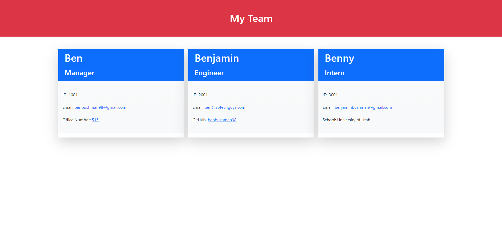

# Team Generator

## Description
This project was developed with node.js and OOP (Object Oriented Programming). When you need quick information on your team, come to the team generator. When you run node index.js in the command line, you are presented with prompts to help you generate your team in a neat and conscise HTML file. You will be able to add a Manager of the team, team engineers, and team interns with their appropriate information. For addition information on how to use this project, use the video walkthrough link below.

## Walkthrough Video Link
[https://drive.google.com/file/d/1ec4i3cMlf0eGpK1hSPkQLQKKQUvR77DX/view?usp=sharing](https://drive.google.com/file/d/14Klq65SeJdgi5DbNcACEAhuRvpedPi1R/view?usp=sharing)

## Screenshot of a generated TEAM

